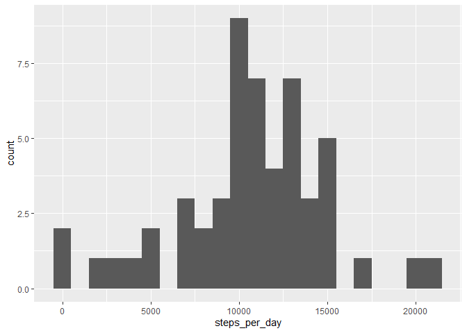
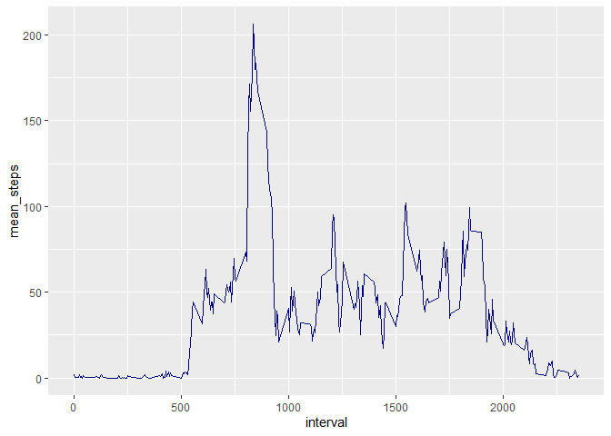

## Loading and preprocessing the data
The data has been downloaded from [the course website](https://d396qusza40orc.cloudfront.net/repdata%2Fdata%2Factivity.zip) at 
May 5th 2021 and added to GitHub repository. All the rows with NA in *steps*
column have been removed.


```r
library(dplyr)
```

```
## 
## Attaching package: 'dplyr'
```

```
## The following objects are masked from 'package:stats':
## 
##     filter, lag
```

```
## The following objects are masked from 'package:base':
## 
##     intersect, setdiff, setequal, union
```

```r
activity_raw <- read.csv("data/activity.csv")
activity <- activity_raw %>%
    filter(!is.na(steps))
head(activity)
```

```
##   steps       date interval
## 1     0 2012-10-02        0
## 2     0 2012-10-02        5
## 3     0 2012-10-02       10
## 4     0 2012-10-02       15
## 5     0 2012-10-02       20
## 6     0 2012-10-02       25
```

## What is the mean total number of steps taken per day?

1. Calculate the total number of steps each day

```r
total_steps <- activity %>%
    group_by(date) %>%
    summarise(steps_per_day = sum(steps))
```
2. Total number of steps take each day. 

```r
library(ggplot2)

total_steps %>%
    ggplot(aes(steps_per_day)) + 
    geom_histogram(binwidth = 1000)
```

<!-- -->

3. Calculate and report the mean and median of the total number of steps taken 
per day.

```r
mean(total_steps$steps_per_day)
```

```
## [1] 10766.19
```

```r
median(total_steps$steps_per_day)
```

```
## [1] 10765
```
## What is the average daily activity pattern?

1. Time series plot of the average number of steps taken


```r
mean_isteps <- activity %>%
     group_by(interval) %>%
     summarise(mean_steps = mean(steps))

 ggplot(mean_isteps, aes(interval, mean_steps)) + geom_line(color = "navy")
```

<!-- -->
2. The 5-minute interval that, on average, contains the maximum number of steps.

```r
mean_isteps$interval[which.max(mean_isteps$mean_steps)]
```

```
## [1] 835
```

## Imputing missing values
1. Calculate and report the total number of missing values in the dataset.

```r
sum(is.na(activity_raw))
```

```
## [1] 2304
```


## Are there differences in activity patterns between weekdays and weekends?
